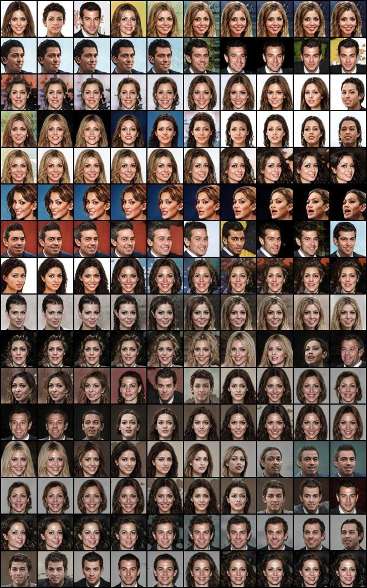
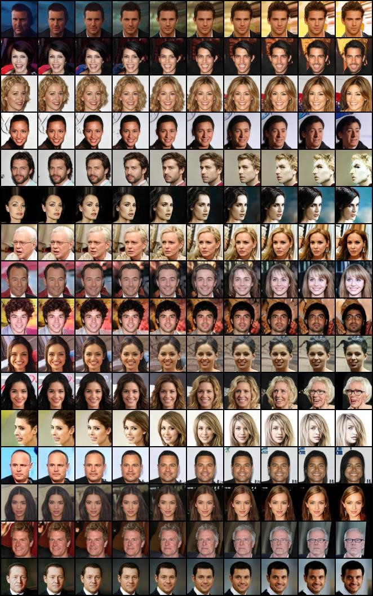
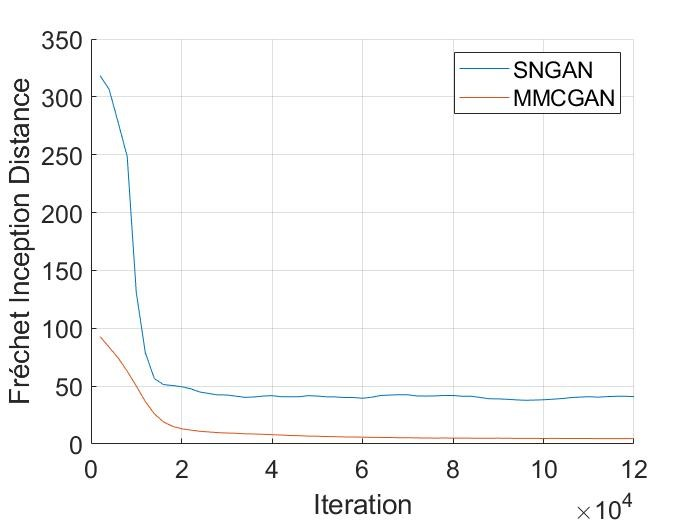

An pytorch implementation of Paper
 "MMCGAN: Generative Adversarial Network with Explicit Manifold Prior" 
 
 # Prerequisites
Python, NumPy, SciPy, Matplotlib A recent NVIDIA GPU

A latest master version of Pytorch 

You'll need the Inception moments needed to calculate FID. These can both be done by modifying and running

bash scripts/utils/prepare_data.sh

# Run

Cifar10:

Raw: bash scripts/launch_cifar_ema.sh

MMCGAN: bash scripts/launch_cifar_MMM_ema.sh

CelebA:

Raw: bash scripts/launch_CelebA_ema.sh

MMCGAN: bash scripts/launch_CelebA_MMM_ema.sh

ImageNet20:

Raw: bash scripts/launch_SAGAN_bs128x2_ema.sh

MMCGAN: bash scripts/launch_SAGAN_MMM_ema.sh

# Results

CelebA:

Raw

Adding MMC, the backgrounds have more diversities and the transition is more natural

MMC also have better FID

# Acknowledge
Based on the implementation https://github.com/ajbrock/BigGAN-PyTorch, igul222/improved_wgan_training and martinarjovsky/WassersteinGAN
